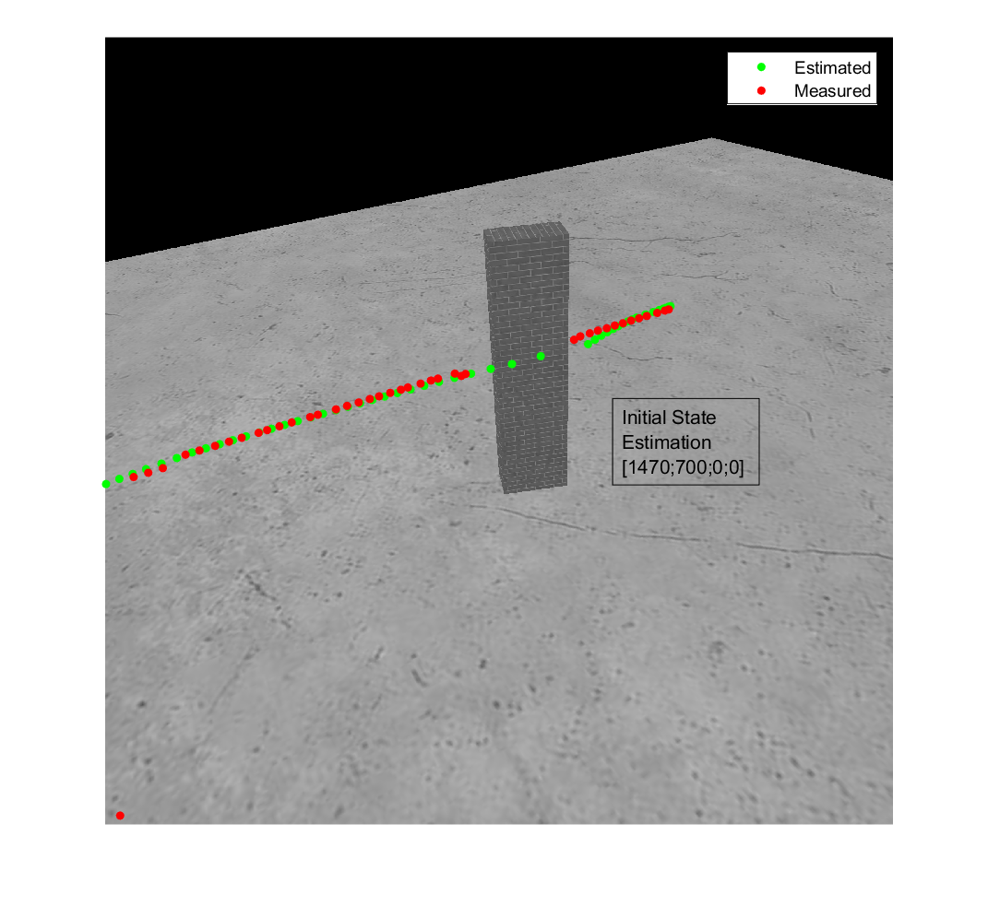
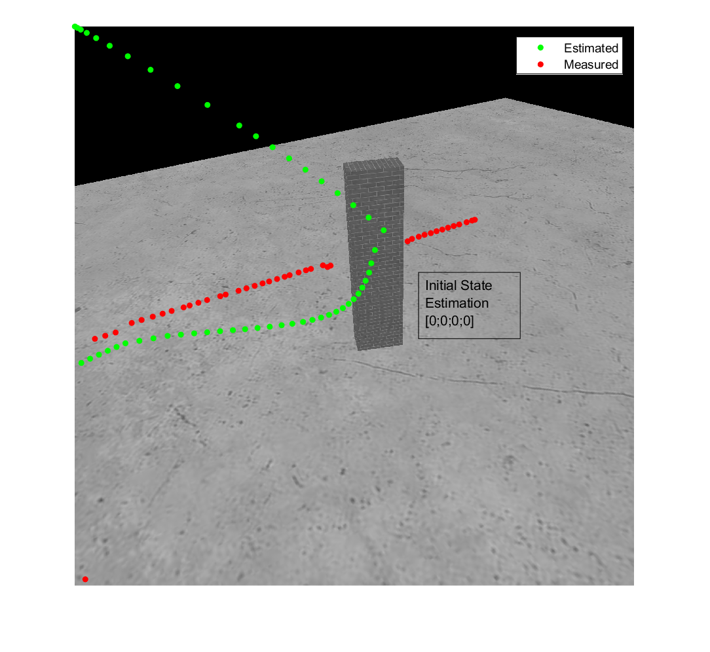

# KalmanFilter
The Kalman Filter equations are implemented to track the robot  
in an image sequence and estimates the robots position, when its hidden behind a  
wall. To get measurements of the position of the robot, a simple pattern  
matching approach is used, which is based on cross-correlation.  
 
Tracking the Robot according to the correlation between images and the pattern: 

 
Initial state estimation = [1470;700;0;0]             | Initial state estimation = [0;0;0;0]
:-------------------------:|:-------------------------:
  |  
